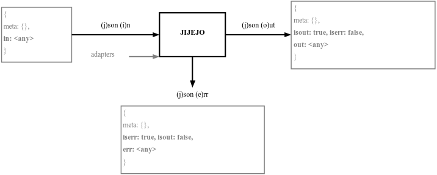

# jijejo-spec

Jijejo is a universal and easy api for all yours applications or libraries. Jijejo is a human and light alternative of [json:api](https://jsonapi.org/), [json-ld](https://json-ld.org/), [hal](http://stateless.co/hal_specification.html), [openapi](https://swagger.io/specification/), [graphql](https://graphql.org/), [joi](https://github.com/hapijs/joi), [zod](https://github.com/vriad/zod), [yup](https://github.com/jquense/yup), [hydra](http://www.markus-lanthaler.com/hydra/) ... Back to basics to get ahead in your business.

jijejo = (**j**)son (**i**)n + (**j**)son (**e**)rr + (**j**)son (**o**)ut

<!---->


## Specifications

> jijejo's specifications can be summarized in 4 rules, nothing else to learn.

### rule n°1: ji = (j)son (i)n

When you call a function, first param is a json with always/only two attributs `.meta`=`{...}`, **`.in`**=`<any>` (second param is an adapters param [Hexagonal architecture](https://en.wikipedia.org/wiki/Hexagonal_architecture_(software)))

```js
{
    "in":  [] | {} | "string" | true | false | null, // 'in' payload
    "meta": {}, // optionnal meta content
}
```

- see schema json [schemas/jijejo.in.schema.json](schemas/jijejo.in.schema.json)
- see also [jijejo-node](https://github.com/AlbanMinassian/jijejo-node) to quickly write [jsonin()](https://github.com/AlbanMinassian/jijejo-node#jsonin) or validate [jicheck()](https://github.com/AlbanMinassian/jijejo-node#jicheck--json-in-check) your (j)son (i)n

### rule n°2: je = (j)son (e)rr

When function detect an error then it always/only return a json with 4 attributs `.meta`=`{...}`, `.isout`=`false`, **`.iserr`=`true`**, **`.err`**=`<any>`, .

```js
{
    "isout": false, // if error then .isout always 'false'
    "iserr": true,  // if error then .iserr always 'true'
    "err":  [] | {} | "string" | true | false | null, // 'err' payload
    "meta": {}, // optionnal meta content
}
```

- see schema json [schemas/jijejo.err.schema.json](schemas/jijejo.err.schema.json)
- see also [jijejo-node](https://github.com/AlbanMinassian/jijejo-node) to quickly write [jsonerr()](https://github.com/AlbanMinassian/jijejo-node#jsonerr) or validate [jecheck()](https://github.com/AlbanMinassian/jijejo-node#jecheck--json-err-check) your (j)son (e)rr

### rule n°3: jo = (j)son (o)ut

When function run without error then it always/only return a json with 4 attributs `.meta`=`{...}`, **`.isout`=`true`**, `.iserr`=`false`, **`.out`**=`<any>`.

```js
{
    "iserr": false,  // if ok then .iserr always 'false'
    "isout": true,   // if ok then .isout always 'true'
    "out":  [] | {} | "string" | true | false | null, // 'out' payload
    "meta": {}, // optionnal meta content
}
```

- see schema json [schemas/jijejo.out.schema.json](schemas/jijejo.out.schema.json)
- see also [jijejo-node](https://github.com/AlbanMinassian/jijejo-node) to quickly write [jsonout()](https://github.com/AlbanMinassian/jijejo-node#jsonout) or validate [jocheck()](https://github.com/AlbanMinassian/jijejo-node#jocheck--json-out-check) your (j)son (o)ut

### rule n°4: nothing else allow

You must catch all unpredictables errors and return a json that respects a (j)son (e)rr.

Javascript example:

```js
try{ 
    throw new Error("unpredictable error");
} catch(error) {  
    return { err: { message: error.message }, iserr: true, isout: false, meta: { ... } }
}
```

### bonus rules: never trust

- never trust incoming (j)son (i)n, always validate it before usage.
- never trust your (j)son (e)rr, always validate it before return.
- never trust your (j)son (o)out, always validate it before return.

<!-- 
rules out of scope:

- never trust your log, always validate it.
- coverage 100% 
-->

## toolkit

- [jijejo-node](https://github.com/AlbanMinassian/jijejo-node) helps to quickly create jsonerr, jsonout jsonin, or to validate them.

## license

Jijejo's specifications are under license [CC-BY-NC-ND-4.0](https://creativecommons.org/licenses/by-nc-nd/4.0/)

[](https://creativecommons.org/licenses/by-nc-nd/4.0/)
